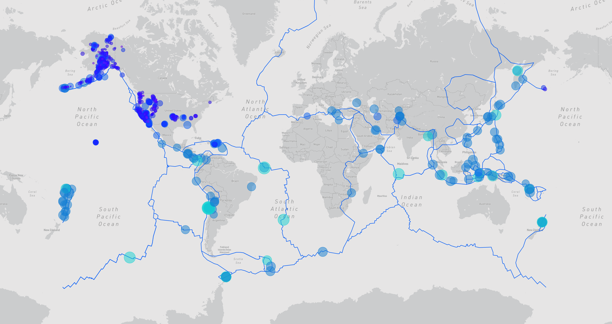

# Mapping Earthquakes with MapBox

 

### Demo Screenshot:

** Note: Open Earthquake_Challenge/Index.html **

### Purpose
The purpose of this project is to visually show the differences between the magnitudes of earthquakes all over the world for the last seven days.

### Technologies Used:
* JavaScript
* D3
* MapBox

### Tasks
To complete this project, I used a URL for GeoJSON earthquake data from the USGS website and retrieved geographical coordinates and the magnitudes of earthquakes for the last seven days. Then add the data to a map.

I added a third map style as an additional tile layer. I also added tectonic plate GeoJSON data to the map to illustrate the relationship between the location and frequency of seismic activity and tectonic plates.

* Use d3.json() to get tectonic plate data and add the data using the L.geoJSON() layer.
* Style the tectonic plate LineString data to stand out on the map.
* Add the tectonic plate data as an overlay with the earthquake data.
* Add a third map style to allow the user to select from three different maps.

### Procedure
The approach used the JavaScript and the D3.js library to retrieve the coordinates and magnitudes of the earthquakes from the GeoJSON data. I used the Leaflet library to plot the data on a Mapbox map through an API request and created interactivity for the earthquake data.
